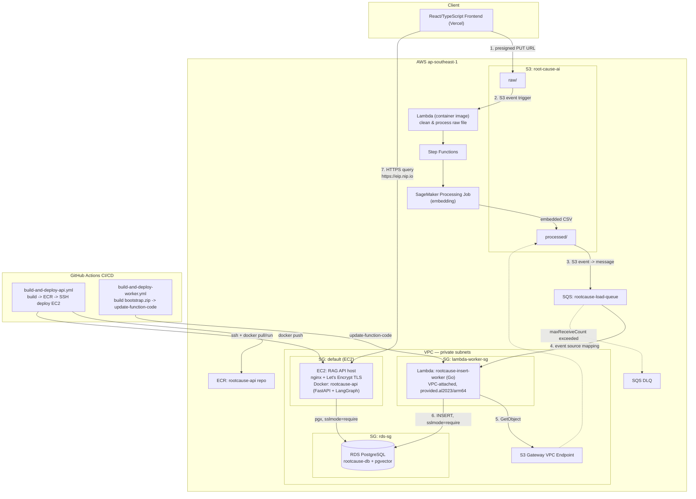

# RootCause AI

Internal dashboard for Quality Engineers — auto-generates a Root-Cause Analysis (RCA) report from new incident text, using the NHTSA vehicle complaints dataset as the retrieval corpus. RAG pipeline built on LangGraph, positioned as portfolio evidence for trustworthy AI / model validation work.

## Architecture



## RAG Pipeline

`retrieve_node` → `analysis_node` → `evaluation_node` → (fail & under max_revision → back to `analysis_node`; pass or max_revision hit → `action_node`)

## Tech Stack

- **Orchestration**: LangGraph (StateGraph)
- **Embedding**: nomic-ai/nomic-embed-text-v1.5 (768-dim, HNSW m=24/ef_construction=200)
- **LLM**: gpt-4o-mini
- **Vector store**: Postgres + pgvector (RDS)
- **API**: FastAPI, deployed on EC2 behind nginx (TLS via Let's Encrypt)
- **Async worker**: Go, AWS Lambda (`provided.al2023`, arm64), SQS-triggered
- **Frontend**: React/TypeScript on Vercel
- **IaC**: manual for now, Terraform planned

## AWS

- **Region**: `ap-southeast-1`
- **S3**: `root-cause-ai` (`raw/` → cleaned by Lambda, `processed/` → embedded CSV output)
- **SQS**: `rootcause-load-queue` (event source mapping, `ReportBatchItemFailures` enabled)
- **RDS**: `rootcause-db` — PostgreSQL + pgvector, private subnet, `sslmode=require`
- **Lambda**: `rootcause-insert-worker` — Go, `provided.al2023`/arm64, VPC-attached
- **EC2**: RAG API host — Elastic IP + `<eip>.nip.io` domain for Let's Encrypt TLS
- **ECR**: `rootcause-api` repo
- **VPC**: S3 Gateway Endpoint attached to Lambda's route table (no NAT Gateway — keeps free tier)
- **Security Groups**: `lambda-worker-sg`, RDS SG, EC2 `default` SG — cross-referenced by SG id, not CIDR
- **IAM (Lambda execution role)**: `AWSLambdaVPCAccessExecutionRole`, `AWSLambdaSQSQueueExecutionRole`, inline `s3:GetObject` on `root-cause-ai/*`

All resources above are still hand-configured via Console, not Terraform — see [Known gaps](#known-gaps).

## Status

Demo/portfolio deployment, torn down between sessions. Not production-hardened (see [Known gaps](#known-gaps)).

## Known gaps

- [ ] Infra not yet in Terraform — see architecture diagram for full resource list
- [ ] Input/output guardrails (prompt injection via free-text `cdescr` field)
- [ ] SQS DLQ not yet configured
- [ ] No LangSmith/Arize Phoenix tracing yet

## Local development

```bash
cp .env.example .env   # fill in AWS + DB credentials
go test -run TestHandler -v ./...
```
