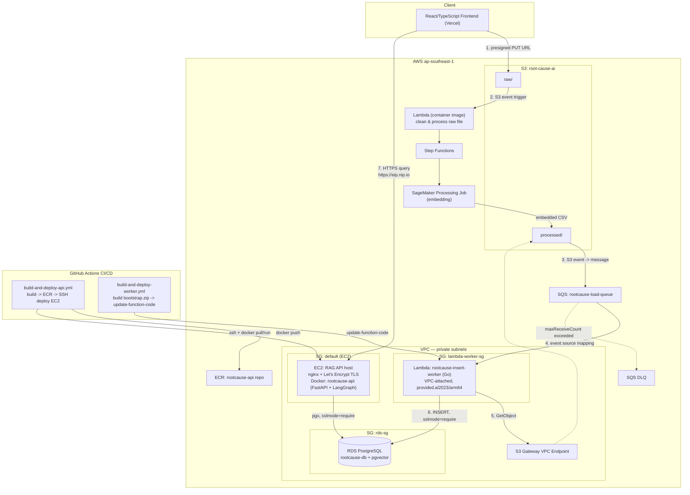

# RootCause AI

Internal dashboard for Quality Engineers — auto-generates a Root-Cause Analysis (RCA) report from new incident text, using the NHTSA vehicle complaints dataset as the retrieval corpus. RAG pipeline built on LangGraph, positioned as portfolio evidence for trustworthy AI / model validation work.

## Architecture


```mermaid
graph TB
    subgraph Client["Client"]
        FE["React/TypeScript Frontend (Vercel)"]
    end

    subgraph AWS["AWS ap-southeast-1"]
        subgraph S3B["S3: root-cause-ai"]
            RAW["raw/"]
            PROC["processed/"]
        end

        LAMBDA_CLEAN["Lambda (container image)<br/>clean & process raw file"]
        SFN["Step Functions"]
        SM["SageMaker Processing Job<br/>(embedding)"]
        SQS["SQS: rootcause-load-queue"]
        DLQ["SQS DLQ"]

        subgraph VPC["VPC — private subnets"]
            subgraph SG_LAMBDA["SG: lambda-worker-sg"]
                LAMBDA_WORKER["Lambda: rootcause-insert-worker (Go)<br/>VPC-attached, provided.al2023/arm64"]
            end

            S3EP["S3 Gateway VPC Endpoint"]

            subgraph SG_EC2["SG: default (EC2)"]
                EC2["EC2: RAG API host<br/>nginx + Let's Encrypt TLS<br/>Docker: rootcause-api (FastAPI + LangGraph)"]
            end

            subgraph SG_RDS["SG: rds-sg"]
                RDS[("RDS PostgreSQL<br/>rootcause-db + pgvector")]
            end
        end

        ECR["ECR: rootcause-api repo"]
    end

    subgraph CICD["GitHub Actions CI/CD"]
        GH1["build-and-deploy-api.yml<br/>build -> ECR -> SSH deploy EC2"]
        GH2["build-and-deploy-worker.yml<br/>build bootstrap.zip -> update-function-code"]
    end

    FE -- "1. presigned PUT URL" --> RAW
    RAW -- "2. S3 event trigger" --> LAMBDA_CLEAN
    LAMBDA_CLEAN --> SFN
    SFN --> SM
    SM -- "embedded CSV" --> PROC
    PROC -- "3. S3 event -> message" --> SQS
    SQS -- "4. event source mapping" --> LAMBDA_WORKER
    SQS -. "maxReceiveCount exceeded" .-> DLQ
    LAMBDA_WORKER -- "5. GetObject" --> S3EP
    S3EP -.-> PROC
    LAMBDA_WORKER -- "6. INSERT, sslmode=require" --> RDS
    EC2 -- "pgx, sslmode=require" --> RDS
    FE -- "7. HTTPS query<br/>https://eip.nip.io" --> EC2

    GH1 -- "docker push" --> ECR
    GH1 -- "ssh + docker pull/run" --> EC2
    GH2 -- "update-function-code" --> LAMBDA_WORKER
```

## RAG Pipeline

`retrieve_node` → `analysis_node` → `evaluation_node` → (fail & under max_revision → back to `analysis_node`; pass or max_revision hit → `action_node`)

## Tech Stack

- **Orchestration**: LangGraph (StateGraph)
- **Embedding**: nomic-ai/nomic-embed-text-v1.5 (768-dim, HNSW m=24/ef_construction=200)
- **LLM**: gpt-4o-mini
- **Vector store**: Postgres + pgvector (RDS)
- **API**: FastAPI, deployed on EC2 behind nginx (TLS via Let's Encrypt)
- **Async worker**: Go, AWS Lambda (`provided.al2023`, arm64), SQS-triggered
- **Frontend**: React/TypeScript on Vercel
- **IaC**: manual for now, Terraform planned

## AWS

- **Region**: `ap-southeast-1`
- **S3**: `root-cause-ai` (`raw/` → cleaned by Lambda, `processed/` → embedded CSV output)
- **SQS**: `rootcause-load-queue` (event source mapping, `ReportBatchItemFailures` enabled)
- **RDS**: `rootcause-db` — PostgreSQL + pgvector, private subnet, `sslmode=require`
- **Lambda**: `rootcause-insert-worker` — Go, `provided.al2023`/arm64, VPC-attached
- **EC2**: RAG API host — Elastic IP + `<eip>.nip.io` domain for Let's Encrypt TLS
- **ECR**: `rootcause-api` repo
- **VPC**: S3 Gateway Endpoint attached to Lambda's route table (no NAT Gateway — keeps free tier)
- **Security Groups**: `lambda-worker-sg`, RDS SG, EC2 `default` SG — cross-referenced by SG id, not CIDR
- **IAM (Lambda execution role)**: `AWSLambdaVPCAccessExecutionRole`, `AWSLambdaSQSQueueExecutionRole`, inline `s3:GetObject` on `root-cause-ai/*`

All resources above are still hand-configured via Console, not Terraform — see [Known gaps](#known-gaps).

## Status

Demo/portfolio deployment, torn down between sessions. Not production-hardened (see [Known gaps](#known-gaps)).

> **Evidence rule.** Everything below comes from the project notes or from the AWS console / Cost Explorer screens checked on 2026-09-30. Text tagged *(inferred)*, *(hypothesis)*, *(suggestion)* or *(general)* is analysis, not a recorded fact. Incidents that are not on record are **not** listed — add them with the template in Appendix B.

## TL;DR

- The architecture fits a **user-facing upload → process → query product** with bursty load and mixed compute (light cleaning, batch embedding); it is **heavier than the static NHTSA dataset alone requires**.
- The bill is dominated by **always-on components** (RDS, EC2, public IPv4, hosted zone), not by the event-driven path.
- The three durable RAG lessons: **measure ANN recall against exact search**, **generator and critic prompts are one contract**, and **"retrieved" is not "evidence"**.

---

## 0. Architecture at a glance

```
Browser (React/TS · Vercel)
  │ ① request upload URL ─▶ API Gateway ─▶ Lambda (presign)
  │ ② PUT file straight to S3 (presigned URL)
  ▼
S3  raw/
  │ S3 event (start)
  ▼
Step Functions (Standard)
  ├─ Lambda (container image): clean  ─▶ S3  clean/
  └─ SageMaker Processing Job: embed  ─▶ S3  embedded/
                                          │ S3 event
                                          ▼
                                  SQS ─▶ Lambda (Go): load ─▶ RDS Postgres + pgvector (HNSW)
                                                                   ▲
Browser ─▶ nginx (TLS) ─▶ RAG API (Python · LangGraph · EC2) ───────┘
          retrieve → analyze → evaluate ⟲ (max_revision) → action
```

*Diagram reconstructed from the project notes; verify the S3 → SQS edge and the trigger mechanisms against the real console/Terraform before publishing it.*

**How the design got here** (from the project notes):

| Date | Change | Recorded driver |
|---|---|---|
| ≤ 09-14 | Kafka-era design (Kafka on Docker, S3 claim-check, one-off GPU embedding, Postgres + pgvector, Node gateway) | — |
| 09-17/18 | Kafka dropped → AWS-native serverless (S3 → Lambda → Step Functions → SageMaker → loader) | not recorded |
| 09-21 | Pipeline hand-built in the console; constraint: stay inside the free tier | free-tier budget |
| 09-24 | Supabase/Railway rejected → RDS Postgres + 2 EC2 (API behind nginx, SQS worker); Node gateway → Python RAG backend | not recorded |
| 09-25 | SQS worker: EC2 systemd → Lambda (Go, `provided.al2023`, arm64, zip) | cost |
| 09-30 | Tear down; Terraform (EC2/RDS ephemeral, VPC permanent); RAG development goes local-first | cost; time spent on infra instead of RAG |

---

## 1. Why this architecture

**Design goals** (reconstructed from the project notes):

1. Users upload files of unpredictable size and timing; processing is asynchronous and the UI tracks status.
2. Ingestion is spiky and mostly idle → pay only when work happens.
3. Stages have different compute profiles (light cleaning vs. batch embedding).
4. Raw data stays immutable and every derived artifact can be re-created (trustworthy-AI / audit framing).
5. The query path is latency-sensitive and stateful (multi-step LLM loop + DB connection pool).

| Decision | Why | What it costs |
|---|---|---|
| **Direct-to-S3 upload via presigned URL** | File bytes bypass the API tier, so API Gateway's ~10 MB and Lambda's ~6 MB synchronous payload limits never apply. Use a presigned **POST** if S3 must enforce a size range (`content-length-range`). | Extra round trip; CORS and expiry to manage; validation shifts to the client plus a post-upload check. |
| **S3 as the hand-off between stages** (claim-check: events carry keys, never data) | Durable, cheap, replayable; each stage is re-runnable from the previous stage's output; raw stays immutable for audit; keeps Step Functions state far below its 256 KiB payload limit. | S3 events are at-least-once and unordered → every stage must be idempotent. |
| **Step Functions (Standard)** orchestrates clean → embed | Explicit state machine with retry/catch and per-execution history; `.sync` waits on the SageMaker job without a Lambda idling (Lambda caps at 15 min). | Per-transition pricing; ASL is awkward to test locally; Express workflows cannot do `.sync`. |
| **Lambda container image** for cleaning | Data libraries (pandas/pyarrow) break the 250 MB zip limit; images go to 10 GB; scales to zero. | ECR storage + image build in CI; cold starts; 15-min / memory ceiling → large files need sharding or a different runtime. |
| **SageMaker Processing Job** for embedding | Batch, GPU-capable, billed only while running; Lambda has no GPU. | Minutes of start-up latency; per-instance-type quotas (GPU can start at 0); role + container plumbing; overkill for a small corpus. |
| **SQS** between "embedded" and the loader | Absorbs bursts so finished files don't stampede Postgres; retries + DLQ; `MaximumConcurrency` caps DB connections. | At-least-once → idempotent load (upsert by natural key); visibility timeout ≥ 6× function timeout; DLQ needs an alarm. |
| **Go Lambda** (`provided.al2023`, arm64, zip) as loader | Small static binary → fast cold start, cheaper per GB-s, no ECR; plays to existing Go skill. | Third language in the repo; custom-runtime packaging (`bootstrap`); contracts duplicated across Python/Go/TS. |
| **RAG API as a persistent service** on EC2 behind nginx (not Lambda) | Multi-step LangGraph runs (retrieve → analyze → evaluate → revise, several LLM calls) fit poorly under API Gateway's default 29 s integration timeout; a warm process keeps its Postgres pool. | Always-on cost; you own patching, TLS renewal, deploys. |
| **RDS Postgres + pgvector**, single datastore | Metadata SQL, joins and vector search in one engine; HNSW index; private in the VPC; no separate vector DB to run. | Largest line on the bill; you own index tuning (see A1), vacuum and vertical scaling. |
| **Vercel** for the frontend | Zero-ops hosting/CDN; independent deploy. | Cross-origin calls (CORS); one more pipeline. |
| **GitHub Actions + Terraform** (Terraform planned) | Repeatable deploys and one-command teardown; VPC permanent, EC2/RDS ephemeral. | State to manage; IaC learning tax. |

**Net:** strong for bursty, user-driven ingestion with mixed compute; expensive in operational surface (3 runtimes/packaging shapes, IAM + event wiring per stage) and in always-on cost for the query tier.

---

## 2. When to use / when not to use

### Use this pattern when

- Work arrives unpredictably (user uploads, partner drops) and the system is idle most of the time — scale-to-zero pays off.
- Stages differ in compute profile (light transform vs. GPU batch) or failure mode, and each must retry and scale independently.
- Raw inputs must stay immutable and every derived artifact reproducible (audit, model validation, regulated domains: finance, automotive, medical).
- Producers and consumers must be decoupled in time — the uploader must not wait for embedding.
- The team already operates AWS (IAM, CloudWatch, IaC) and someone owns on-call.

### Don't use it when

- The job is a **one-off or periodic batch on a dataset that fits one machine** — cron + script + `COPY` wins on cost, debuggability and onboarding time.
- Nobody can own the operational surface — every stage adds IAM roles, event wiring, packaging, logs and alarms.
- End-to-end latency matters — SageMaker start-up and state transitions add minutes.
- Load is a **sustained high-volume stream** — per-invocation pricing loses to long-running consumers on Kafka/Kinesis, which also give ordering and replay that S3 events don't.
- You need strict ordering or exactly-once semantics — S3 events are at-least-once and unordered.
- The always-on tier (DB + servers) dominates cost and the budget is small — serverless on the ingestion path saves little (see B1).
- Local-development experience matters more than production shape — cloud-only stages are hard to run and test on a laptop (see B5).

### The ladder — climb only on measured pain

| Rung | Shape | Move up when |
|---|---|---|
| 0 | cron/script → `COPY` into Postgres | data volume or freshness outgrows one box / one run |
| 1 | docker-compose: Postgres + pgvector, one worker, one API on a VM | you need isolation, restarts, more than one worker |
| 2 | queue + workers (SQS, or Redis/Postgres-backed) | you need retries, backpressure, independent scaling |
| 3 | event-driven serverless orchestration (**this project**) | you need scale-to-zero, mixed compute, an audit trail across many stages |
| 4 | streaming platform (Kafka/Kinesis) | sustained high throughput, multiple consumers, replay/ordering |

Move up on a **measured** pain — throughput, isolation, team boundary, audit requirement — not on preference.

### Applied to this project (self-assessment)

| Condition that justifies the pattern | This project |
|---|---|
| Unpredictable user uploads with async status tracking | **Yes** — dashboard upload flow |
| Heavy batch/GPU compute on demand | **Yes** — embedding via SageMaker Processing |
| Raw-input audit / replay | **Partly** — raw kept in S3, no formal lineage |
| Sustained high-volume stream | No — bulk dataset |
| Data too large for one machine/script | Probably not *(inferred)* — embedding is the only heavy step |
| Several independent consumers | No |
| Several teams owning stages | No |

**Verdict.** Defensible for the upload → process → query product flow and as a vehicle for practising production patterns; **heavier than the static NHTSA data alone needs** — a script baseline (rung 0–1) would load the same dataset with a fraction of the moving parts. State this trade-off in the README and keep a baseline for comparison.

---

## 3. Problem log

Format per entry: **Symptom → Cause → Fix → Lesson**. Status: **Fixed** · **Mitigated** · **Open** · **Gotcha** (design constraint, not an incident).

### Part A — RAG

**A1. HNSW recall collapsed on near-duplicate data — Fixed**

- *Symptom:* with pgvector's default HNSW (`m=16`) retrieval scores looked clustered and recall was poor on the near-duplicate-heavy NHTSA complaints.
- *Diagnosis:* compared index results against exact top-k from a brute-force `ROW_NUMBER() OVER (ORDER BY distance)` query.
- *Fix:* rebuilt the index with `m=24`, `ef_construction=200`; retrieval latency ~45 ms afterwards (target < 50 ms, as reported on 2026-09-14).
- *Lesson:* ANN is approximate by design — measure recall@k against exact search on **your** data before trusting it. *(Hypothesis: near-identical vectors fill each node's neighbour list and thin out graph connectivity.)*
- *Next (suggestion):* approximate indexes apply `WHERE` filters **after** the index scan, so adding make/model/year filters can silently cut recall — re-measure, and use pgvector ≥ 0.8.0 `hnsw.iterative_scan`. Consider de-duplicating or clustering near-identical complaints before indexing.

**A2. Generator/critic contradiction → revise loop that never converged — Fixed**

- *Symptom:* `evaluation_node` kept failing drafts, so `analysis_node` ⇄ `evaluation_node` looped.
- *Cause:* the prompts contradicted each other — the evaluator demanded a single root cause while the analyzer was told to state ambiguity honestly; no draft could satisfy both.
- *Fix:* the evaluator may PASS a report that gives 2–3 cited candidate causes; `max_revision` stays as the hard stop. The pipeline now passes in 1–2 revisions.
- *Lesson:* in a generate → critique loop the two prompts are **one contract**. Test the loop on ambiguous inputs, cap iterations, and log each critique so a non-converging loop is visible.

**A3. Real citation attached to the wrong failure mechanism — Mitigated (not proven fixed)**

- *Symptom:* the report cited a genuine retrieved complaint as support for a failure mechanism that complaint does not describe.
- *Cause:* semantic similarity ≠ causal similarity — retrieval returns topically close text and the LLM over-attributes it.
- *Mitigation:* both nodes are instructed to verify that each citation supports the *specific* mechanism claimed.
- *Residual risk:* a prompt-only fix is unmeasured. It needs a claim-support/faithfulness metric (Ragas), a judge from a different model, and a regression set of known misattributions *(suggestion)*.
- *Lesson:* "retrieved" is not "evidence" — make support a checked property, not an instruction.

**A4. Citation list = everything retrieved — Fixed**

- *Symptom:* `action_node` output listed all 20 retrieved complaints as citations, overstating the evidence.
- *Fix:* regex-extract the `[id]` tokens from `draft_report` and show only those.
- *Lesson:* cited ⊂ retrieved.
- *Next (suggestion):* assert every extracted id exists in `retrieved_docs` — LLMs can invent ids — and drop or flag the rest.

**A5. Embedding contract between index time and query time — Gotcha**

- `nomic-embed-text-v1.5` (768-dim) requires task prefixes (`search_document: ` when indexing, `search_query: ` when querying) and normalized vectors; a mismatch degrades recall **silently**, with no error.
- Indexing (SageMaker job) and querying (RAG service) are separate deployables, so one shared preprocessing function and a pinned model revision are the only safeguards *(suggestion)*.
- *Lesson:* treat embedding configuration as part of the schema — store model id + revision next to the vectors *(suggestion)*.

**A6. Same model judges its own output — Open**

- `analysis_node` and `evaluation_node` both use gpt-4o-mini; correlated blind spots and self-preference make the evaluator lenient toward its own style *(general)*.
- *Plan (on roadmap):* judge with a different model; measure faithfulness with Ragas.

**A7. Prompt-injection surface — Open (planned)**

- `cdescr` is free text submitted by the public to NHTSA, and the user's incident text also enters the prompt; either can carry instructions.
- *Plan:* input/output guardrails — delimiters around untrusted text, citation filter, URL sanitization (the last two from the earlier design notes). Not yet implemented per the notes.
- *Lesson:* retrieved documents are **untrusted input**, not context.

**A8. Debugging blind — Open**

- LangGraph runs were debugged with `print()`.
- *Plan:* LangSmith tracing; Arize Phoenix (UMAP/t-SNE) to visualise the embedding space and explain the A1 failure; Ragas + MLflow for regression tracking.
- *Lesson:* instrument before you tune.

### Part B — Deployment

**B1. Always-on components dominate the bill — Partly fixed (teardown in progress)**

Cost Explorer, September 2026 to date (partial month), total **$9.30**:

| Line | $ | Kind |
|---|---|---|
| RDS | 3.87 | always-on |
| EC2 instances | 1.92 | always-on |
| "VPC" | 1.36 | public IPv4, always-on *(inferred — confirm by Usage Type)* |
| Tax | 0.85 | — |
| EC2-Other | 0.52 | EBS/transfer, mostly always-on *(inferred)* |
| Route 53 | 0.51 | hosted zone, fixed |
| ECR | 0.20 | image storage |
| Cost Explorer | 0.05 | — |
| SageMaker | 0.03 | pay-per-use |
| S3 | 0.01 | storage |
| API Gateway, Glue, KMS, Lambda, Step Functions, SQS | 0.00 | pay-per-use |

- *Cause:* RDS + EC2 (+ public IPv4 + hosted zone) run 24/7 for a demo with almost no traffic. The always-on/fixed lines (RDS, EC2, VPC, EC2-Other, Route 53) total **$8.18 ≈ 97 % of pre-tax spend**; the pay-per-use pipeline totals **≈ $0.04**.
- *Fix:* tear down the hand-built stack; Terraform so EC2/RDS come up and down in minutes; SQS worker moved from EC2 to Lambda (recorded 09-25).
- *Lesson:* separate **idle cost** from **usage cost** when choosing serverless vs. always-on. Add an AWS Budgets alert and tag resources by lifecycle *(suggestion)*.

**B2. Misreading the bill: the "VPC" line is not the VPC — Resolved**

- *Symptom:* $1.36 under service "VPC" raised the question of deleting the VPC.
- *Finding:* VPC, subnets, route tables, internet gateway, security groups and NACLs are free. Console inventory for ap-southeast-1: 1 VPC, 3 subnets, 1 route table, 1 IGW, 8 security groups, 1 NACL, 1 DHCP option set; **NAT gateways 0, Elastic IPs 0**, peering 0, VPN/VGW 0. The $1.36 is public IPv4 at $0.005/h per address (≈ 272 IP-hours) *(inferred)*.
- *Decision:* keep the VPC (free; painful to recreate); delete the cost-bearing resources.
- *Lesson:* read Cost Explorer **by Usage Type** (`*PublicIPv4:InUseAddress`, `NatGateway-Hours`) before deleting anything. Price anatomy: NAT gateway ≈ $0.045/h + $0.045/GB (us-east-2 list price; ≈ $33/month idle), public IPv4 $0.005/h (≈ $3.65/month each), interface endpoints ≈ $0.01/h per AZ *(general, not re-checked)*.

**B3. Hand-built in the console (ClickOps) — Fixing with Terraform**

- *Symptom:* the pipeline was assembled by hand (Step Functions → clean Lambda → SageMaker Processing Job, S3-triggered start); nothing reproducible or reviewable, and teardown means hunting for leftovers manually.
- *Fix:* Terraform with a lifecycle split — VPC permanent, EC2 + RDS ephemeral (recorded).
- *Lesson (suggestion):* manage the VPC as its own stack (import the existing one) and let the ephemeral stack read it via a data source or remote state, so `destroy` on the expensive layer cannot touch the network layer.

**B4. Architecture churn in the cloud — Rework cost**

- *Symptom:* five major redesigns in under two weeks (Kafka → serverless, Supabase → RDS, Node → Python, EC2 worker → Lambda, console → Terraform / local-first), each re-touching IAM, networking or CI/CD.
- *Cause:* drivers are recorded only for the cost-driven changes; the others are not on record.
- *Lesson (suggestion):* freeze the **contracts** first — S3 key layout, event/message schema, DB schema — so the infrastructure behind them stays swappable.

**B5. Time went to infrastructure instead of RAG work — Open (plan: local-first)**

- *Symptom (self-reported, 2026-09-30):* too many things to handle and too many choke points; the wish was to spend the time on RAG development.
- *Plan (recorded):* shelve infra, develop the RAG locally, bring infra up only to integration-test.
- *How (suggestion):* keep stage logic as plain functions behind thin handlers; docker-compose for Postgres + pgvector; MinIO or LocalStack for S3; a 1–5k-row fixture dataset; `make up` / `make down` for the on-demand cloud environment.

**B6. Many deployment shapes — Open (accepted trade-off)**

- The pipeline uses a Lambda container image (via ECR), a Lambda zip (Go `bootstrap`, arm64), an EC2 service behind nginx + Let's Encrypt, plus Vercel and GitHub Actions — each with its own build, IAM, logging and release path.
- *Consequence:* high change cost per stage and more places to break (the self-reported choke points).
- *Lesson:* each additional packaging/runtime shape must earn its keep. The Go zip avoids ECR storage and image builds *(inferred)*, but it adds a language and a build path.

**B7. Quotas and provisioning lead time — Gotcha**

- GPU instance quotas can start at **0** on new accounts (recorded during the earlier EC2 g4dn plan); SageMaker has its own per-instance-type quotas (e.g. "ml.g4dn.xlarge for processing job usage"), and increases need a Service Quotas request.
- *Lesson:* check quotas as step 0 of any GPU/batch design.

---

## Appendix A — Known failure modes to verify (design-time; not confirmed incidents)

1. **S3 events are at-least-once and unordered** → deterministic output keys and idempotent loads (upsert by natural key).
2. **SQS + Lambda:** visibility timeout ≥ 6× function timeout; DLQ lives on the queue's redrive policy (`maxReceiveCount` ≥ 5 recommended); cap concurrency with `MaximumConcurrency` to protect Postgres connections; return partial-batch failures.
3. **Lambda inside a VPC** (needed to reach private RDS) has no route to AWS APIs without NAT (≈ $33/month idle) or VPC endpoints (S3 gateway endpoint is free; interface endpoints bill hourly) — verify how the loader reaches S3.
4. **Step Functions:** use Standard workflows for `.sync` (Express supports only Request-Response); keep state payloads small and pass S3 URIs, never data.
5. **API Gateway** default integration timeout is 29 s (raisable on Regional/private REST APIs, possibly at the cost of a lower account throttle quota) → long LangGraph runs belong behind a persistent service or streaming.
6. **Idle-cost traps:** a stopped RDS instance restarts itself after 7 days; public IPv4 is billed while idle; a hosted zone costs ≈ $0.50/month.
7. **pgvector filtering:** approximate indexes filter after the scan → re-measure recall with `WHERE` clauses; use ≥ 0.8.0 iterative scans.
8. **SageMaker** adds minutes of start-up latency → unsuitable for synchronous, interactive flows.

## Appendix B — Template for incidents not captured here

```
### <A|B>N. <title> — <Fixed | Mitigated | Open | Gotcha>
- Symptom:
- Cause:
- Fix:
- Lesson:
- Evidence (commit / log line / metric / screenshot):
```

## References

- [Step Functions — service integration patterns](https://docs.aws.amazon.com/step-functions/latest/dg/connect-to-resource.html)
- [API Gateway — integration timeout beyond 29 s (June 2024)](https://aws.amazon.com/about-aws/whats-new/2024/06/amazon-api-gateway-integration-timeout-limit-29-seconds/)
- [Lambda — SQS event source mapping](https://docs.aws.amazon.com/lambda/latest/dg/services-sqs-configure.html)
- [pgvector 0.8.0 — iterative index scans](https://docs.pgedge.com/pgvector/v0-8-0/iterative-index-scans/)
- [SageMaker — ResourceLimitExceeded and quotas](https://repost.aws/knowledge-center/sagemaker-resource-limit-exceeded-error)
- [S3 uploads — presigned POST vs PUT](https://aws.amazon.com/blogs/networking-and-content-delivery/implementing-secure-file-uploads-to-amazon-s3-at-the-edge-choosing-the-right-pattern)
- [Amazon VPC pricing](https://aws.amazon.com/vpc/pricing/)
